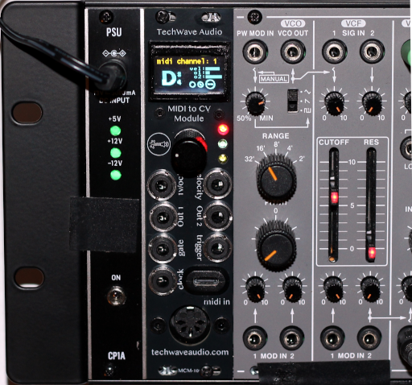
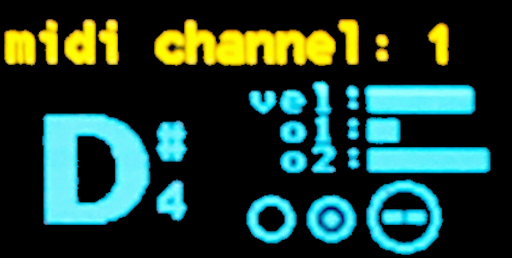
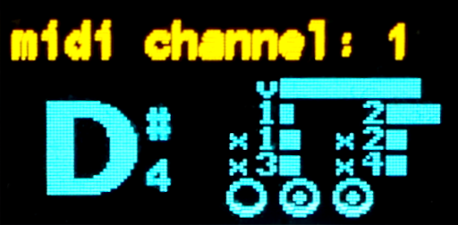

# [TechWave Audio MIDI to CV Module](https://techwaveaudio.com/techwave-audio-mcm-100-midi-to-cv-eurorack-module/) : MCM-100

A monophonic MIDI controller Eurorack module using the Raspberry Pi Pico (RP2040).

Brought to you by [TechWave Audio](https://techwaveaudio.com)



## Features
* Single or omni MIDI channel input
* MIDI input via class-compliant USB-C or standard 5-pin MIDI cable
* Four CV outputs for note (1v/oct), Velocity, assignable Out 1 and Out 2 
  * 1v/octave through 10 octaves (at 0 to +10v), or 5 octaves (at 0 to +5v)
  * Two CV outputs with flexible routing
  * All CV outputs voltage selectable from 0v to +10v or 0 to +5v
* Expandable with additional four flexible-routed CV outputs.
* Gate, trigger, and clock full 0 to +5v outputs with divisible clock sync ticks
* Selectable note priority (last, highest, lowest)
* Tuneable pitch and velocity adjust
* Customizable trigger output duration pulse width
* Pitch bend response range from 0 to 5 octaves
* Real time display of note and output states
* Settings persist to on-board flash ROM
* 6hp wide, 3U height
* Max Power Draw:
  * +12v: 72mA (80mA with expansion) 
  * -12v: 15mA (20mA with expansion)
  * +5v: 0mA


[](https://ko-fi.com/techwaveaudio)

---

### Responds to the following MIDI messages:

* **Note on / off**: sends/stops the note and velocity outputs.
  * Sends a trigger pulse on note on, and turns on the gate for the duration of the note.
  * For +10v output, responds to C-1 (note number 0) to B9 (note number 119).
  * For +5v output, responds to C2 (middle-C, note number 36) to B6 (note number 95).
* **Volume**: increases or decreases the velocity output.
* **Pitch bend**: modifies any currently playing note. Adjustable range from 0 to 5 octaves. 
* **Sustain**: holds a note on while the sustain is active.
* **Aftertouch**: selectable as an aux and/or control output.
* **Expression**: selectable as an aux and/or control output.
* **Mod wheel**: selectable as an aux and/or control output.
* **Effect 1**: selectable as an aux and/or control output.
* **Effect 2**: selectable as an aux and/or control output.
* **Start** and **Continue** sequence: selectable as an aux and/or control output.
* **Stop** sequence: selectable as an aux and/or control output.
* **Mute** (all notes off): clears any note, velocity, and gate outputs.
* **Clock tick**: MIDI clock ticks are sent directly to the `Clock` output and can be routed as an aux and/or control output.
* **Reset**: reset the MIDI input messaging queue and stops any output.

---

### Inputs

* **MIDI in**: single channel or respond to all channels (omni)
  * Both MIDI via UART and USB MIDI device in (as of v1.2.0) 
* **Menu navigation**: Five way switch (up/down, left/right, push enter)

--- 
### Outputs

* Four CV outputs:
  * **Note**: 0 to 10v output (selectable to 0 to 5v) for CV with 1v per octave.
  * **Velocity**: 0 to 10v output (selectable to 0 to 5v) for velocity / volume
  * **Out 1**: customizable CV output (0v to +10v max, selectable to 0v to +5v)
  * **Out 2**: customizable CV output (0v to +10v max, selectable to 0v to +5v)
* **Trigger**: single pulse when a note turns on, with customizable pulse on time (high / low level output)
* **Gate**: signal goes high while a note is on (high / low level output)
* **Clock**: 1ms pulse with each MIDI clock tick (high / low level output). Selectable to various clock divisions.

Using the MCM-100-EX Expansion Module, you can also add an additional four assignable CV outputs.

---

### Power

This module requires a full 16 pin (2x08 connector) standard Eurorack power connection as it uses both +/- 12v lines as well as the +5v source. 
Optional selectors in the hardware (via a DIP switch) allow the note signal to pass through to the CV bus line, and the gate signal as well.

Be certain when you plug the connector in that the orientation is the correct way, with the -12v line on the bottom (usually with the red stripe).

---

## Usage

On startup, you should see the boot screen with the current version:


The note and clock LEDs should turn on and off a few times before the dashboard screen is shown and the module is ready to be used.

The user manual can be found on the [TechWave Audio website](https://techwaveaudio.com/support/manuals/MCM-100-User_Manual.pdf).

### Dashboard




The dashboard shows the status of the current MIDI channel that it is listening on, as well as various outputs:
* The note and octave
* `vel`: The current velocity (corresponding to 0v to +10/+5v)
* `o1`: The current Out 1 value (corresponding to 0v to +10/+5v)
* `o2`: The current Out 2 value (corresponding to 0v to +10/+5v)
* Indicators for the state of the trigger, gate, and clock



If the MCM-100-EX expansion module is attached, additionally it will show:
* `x1`: The current Out X1 value (corresponding to 0v to +10/+5v)
* `x2`: The current Out X2 value (corresponding to 0v to +10/+5v)
* `x3`: The current Out X3 value (corresponding to 0v to +10/+5v)
* `x4`: The current Out X4 value (corresponding to 0v to +10/+5v)

While using the module, you can turn the dashboard display on and off via the display settings menu.
You can also adjust how often the display refreshes (set to a longer time if display events start to get dropped, shorter time for more frequent updates).

### Settings Menu

There are numerous settings available from the settings menu.
Pressing the encoder button on the dashboard display (regardless if the display is visible or not) will enter the menu.
See the [Menu System](./docs/MENU_SYSTEM.md) documentation for the menu system details.

**Note**: any settings are not persisted until you exit the menu back to the dashboard (with the exception of when resetting the settings to default).

## Building the Firmware From Source

### Prerequisites

* [Raspberry Pi Pico SDK](https://github.com/raspberrypi/pico-sdk)
* CMake
* Your favourite C++ compiler
* A compatible toolchain for building Pico firmware

### Setup

1. Initialize the Git submodules:
   1. run: `git submodule init`
   2. run: `git submodule update`
2. Copy the `.env.cmake.sample` to `.env.cmake`
3. Edit your `.env.cmake` for the following variables:
```
PICO_SDK_PATH {the path to the PICO_SDK directory)
PICO_TOOLCHAIN_PATH (path to the pico toolchain for your build machine)

# You should _not_ have to change the following
set(PICO_PLATFORM rp2040)
set(PICO_BOARD pico)
```

### Build script
```
./build.sh
```

This will run the full clean and build.

The firmware file will be put in:
```
./dist/TechWaveAudio-MCM-v2.0.0.uf2
```

## Firmware Updates

For this, you'll need a [firmware release](https://github.com/TechWave-Audio/TechWaveAudio-MidiControllerModule/releases) (or build your on locally), as well as a USB cable that has a micro-usb port on one end.

1.	Power off your rack.
2.	Remove the module from your rack but keep the module plugged in via the power cable.
3.	Download the desired firmware file version from the GitHub repository [firmware release](https://github.com/TechWave-Audio/TechWaveAudio-MidiControllerModule/releases). You only need to download the file with the .uf2 extension.
4.	Plug your USB-C cable into the jack on the front of the module and the other end into the computer with the firmware.
5.	While holding down the small boot select (BOOTSEL) button on the board, power on the module. Keep holding the boot select button until the module appears on your computer. The on-board Raspberry Pi Pico board will appear as a mass storage device, usually named “RPI-RP2”
6.	Copy the downloaded firmware .uf2 file to the storage device. When complete, the module should reboot.
7.	Power off your rack again.
8.	Disconnect your USB cable from the module and your computer. Your computer may give you a warning about the device not being properly ejected. You can safely ignore this warning.
9.	Put the module back into your rack and power back on.

Note that any settings you many have modified will be reset to any default.

## Design

## Schematic, PCB, and hardware

See the [hardware design](./docs/HARDWARE_DESIGN.md) documentation for information on the schematic and PCB design for the module.

Note - all files provided including KiCad designs and any gerber files are provided as-is and to be used at your own risk.
TechWave Audio does not guarantee the accuracy or any correctness of these files.
See the [HW_LICENSE license file](./HW_LICENSE.txt) for more, specifically the section "6 DISCLAIMER AND LIABILITY".

## Licensing

Software in this repository is licensed under the [BSD-3 License](LICENSE.txt). By using or contributing content to this repository you are agreeing to place your contributions under this license.

Hardware designs for this repository are [licensed under the CERN-OHL-S](HW_LICENSE.txt) ([CERN Open Hardware License](https://cern-ohl.web.cern.ch/)).

Parts of this repository may reference, depend on, or use compiled third party libraries. See [NOTICE.txt](NOTICE.txt) for additional details.
