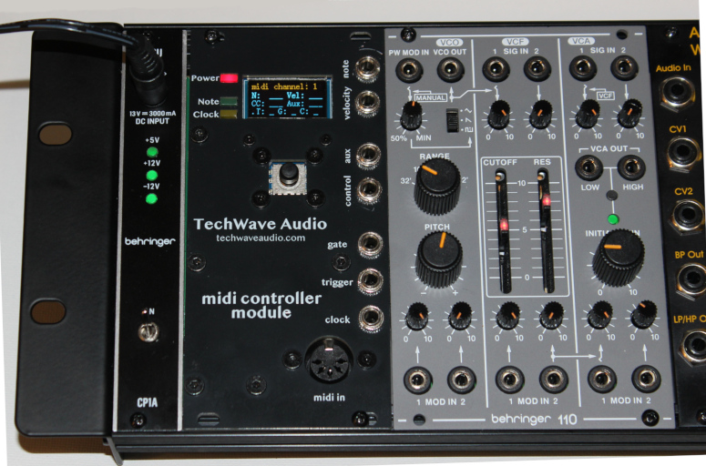
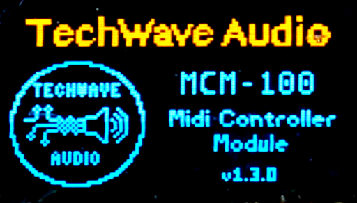
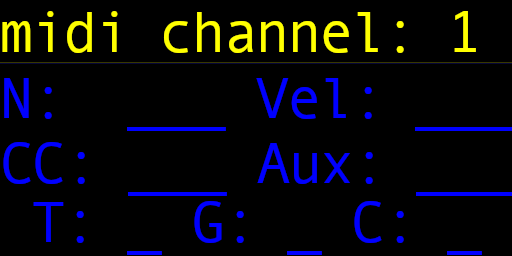

# [TechWave Audio MIDI Controller Module](https://techwaveaudio.com/midi-controller-module/)

A monophonic MIDI controller Eurorack module using the Raspberry Pi Pico (RP2040).

Brought to you by [TechWave Audio](https://techwaveaudio.com)



## Features
* Single or omni MIDI channel input
* Four CV outputs for note (1v/oct), velocity, aux and control selectable 0 to +10v or 0 to +5v
  * 1v/octave through 10 octaves (at 0 to +10v), or 5 octaves (at 0 to +5v)
* Gate, trigger, and clock full 0 to +5v pulse outputs
* Customizable trigger output duration pulse width
* Pitch bend response range from 0 to 5 octaves
* Full display of output states
* Designed to fit in 12hp, 3U module
* Power Draw:
  * +5v: 70mA
  * +12v: 20mA
  * -12v: 15mA

[](https://ko-fi.com/techwaveaudio)

### Responds to the following MIDI messages:

* **Note on / off**: sends/stops the note and velocity outputs.
  * Sends a trigger pulse on note on, and turns on the gate for the duration of the note.
  * For +10v output, responds to C-1 (note number 0) to B9 (note number 119).
  * For +5v output, responds to C2 (middle-C, note number 36) to B6 (note number 95).
* **Volume**: increases or decreases the velocity output.
* **Pitch bend**: modifies any currently playing note. Adjustable range from 0 to 5 octaves. 
* **Sustain**: holds a note on while the sustain is active.
* **Aftertouch**: selectable as an aux output.
* **Expression**: selectable as a aux output.
* **Mod wheel**: selectable as a control output.
* **Effect 1**: selectable as a control output.
* **Effect 2**: selectable as a control output.
* **Mute** (all notes off): clears any note, velocity, and gate outputs.
* **Clock tick**: MIDI clock ticks are sent directly to the `Clock` output.
* **Reset**: reset the MIDI input messaging queue and stops any output.

### Inputs

* **MIDI in**: single channel or respond to all channels (omni)
* **Menu navigation**: Five way switch (up/down, left/right, push enter)

### Outputs

* Four CV outputs:
  * **note**: 0 to 10v output (selectable to 0 to 5v) for CV with 1v per octave.
  * **velocity**: 0 to 10v output (selectable to 0 to 5v) for velocity / volume
  * **aux**: customizable aux message output (0v to +10v max, selectable to 0v to +5v)
    * aux outputs from MIDI aftertouch or expression.
  * **control**: customizable control output (0v to +10v max, selectable to 0v to +5v)
    * control outputs from mod wheel, effect 1 or effect 2.
* **trigger**: single pulse when a note turns on, with customizable pulse on time (high / low level output)
* **gate**: signal goes high while a note is on (high / low level output)
* **midi clock**: 1ms pulse with each MIDI clock tick (high / low level output)

There are two additional switches (via a DIP switch on the rear) to allow the note CV and gate signals to be sent to the CV and Gate bus lines of the 16 pin bus power connector.

### Power

This module requires a full 16 pin (2x08 connector) standard Eurorack power connection as it uses both +/- 12v lines as well as the +5v source. 
Optional selectors in the hardware (via a DIP switch) allow the note signal to pass through to the CV bus line, and the gate signal as well.

Be certain when you plug the connector in that the orientation is the correct way, with the -12v line on the bottom (usually with the red stripe).

## Usage

On startup, you should see the boot screen with the current version:



The note and clock LEDs should turn off an off a few times before the dashboard screen is shown.

### Dashboard




The dashboard shows the status of the current MIDI channel that it is listening on, as well as various outputs:
* `N`: The current note (note name and octave)
* `Vel`: The current velocity (from 0 to 128, corresponding to 0v to +10/+5v)
* `CC`: The current control value (from 0 to 128, corresponding to 0v to +10/+5v)
* `Aux`: The current aux value (from 0 to 128, corresponding to 0v to +10/+5v)
* `T`: The trigger level (on or off)
* `G`: The gate level (on or off)
* `C`: The clock level (on or off)

While using the module, you can turn the dashboard display on and off via the [display settings menu](./docs/MENU_SYSTEM.md#display-settings).
You can also adjust how often the display refreshes (set to a longer time if display events start to get dropped, shorter time for more frequent updates).

### Settings Menu

There are numerous settings available from the settings menu.
Pressing the `Enter` button from the dashboard display (regardless if the display is visible or not) will enter the menu.
See the [Menu System](./docs/MENU_SYSTEM.md) documentation for the menu system details.

**Note**: any settings are not persisted until you exit the menu back to the dashboard (with the exception of when resetting the settings to default).

## Building the Firmware From Source

### Prerequisites

* [Raspberry Pi Pico SDK](https://github.com/raspberrypi/pico-sdk)
* CMake
* Your favourite C++ compiler
* A compatible toolchain for building Pico firmware

### Setup

1. Copy the `.env.cmake.sample` to `.env.cmake`
2. Edit your `.env.cmake` for the following variables:
```
PICO_SDK_PATH {the path to the PICO_SDK directory)
PICO_TOOLCHAIN_PATH (path to the pico toolchain for your build machine)

# You should _not_ have to change the following
set(PICO_PLATFORM rp2040)
set(PICO_BOARD pico)
```

### Build script
```
./build.sh
```

This will run the full clean and build.

The firmware file will be put in:
```
./dist/TechWaveAudio-MCM.uf2
```

## Firmware Updates

For this, you'll need a [firmware release](https://github.com/TechWave-Audio/MidiControllerModule/releases) (or build your on locally), as well as a USB cable that has a micro-usb port on one end.

0. If not already removed, remove the module from your rack
1. _**VERY IMPORTANT**_: unplug the module from your Eurorack power supply
2. Download the `.uf2` firmware file (from [releases](https://github.com/TechWave-Audio/MidiControllerModule/releases))
3. (optional) Remove the Raspberry Pi Pico board from the module
4. Plug the micro-usb plug of the cable into the Raspberry Pi Pico board
5. **While holding down the small boot select button on the board**, plug the other end into your computer. The Raspberry Pi Pico board will appear as a flash drive.
6. Copy the firmware `.uf2` file to the Pi Pico drive. When complete, the Pi Pico should reboot. You can safely disconnect the cable
7. Put the Pi Pico board back into the module if you removed it, and put the module back into your rack. 

Note that any settings you many have modified will be reset to any default.

## Design

### How it works
See the [software design](./docs/SOFTWARE_DESIGN.md) documentation for information on how the firmware works.

## Schematic, PCB, and hardware

See the [hardware design](./docs/HARDWARE_DESIGN.md) documentation for information on the schematic and PCB design for the module.

## Licensing

Software in this repository is licensed under the [BSD-3 License](LICENSE.txt). By using or contributing content to this repository you are agreeing to place your contributions under this license.

Hardware designs for this repository are [licensed under the CERN-OHL-S](HW_LICENSE.txt) ([CERN Open Hardware License](https://cern-ohl.web.cern.ch/)).

Parts of this repository may reference, depend on, or use compiled third party libraries. See [NOTICE.txt](NOTICE.txt) for additional details.
