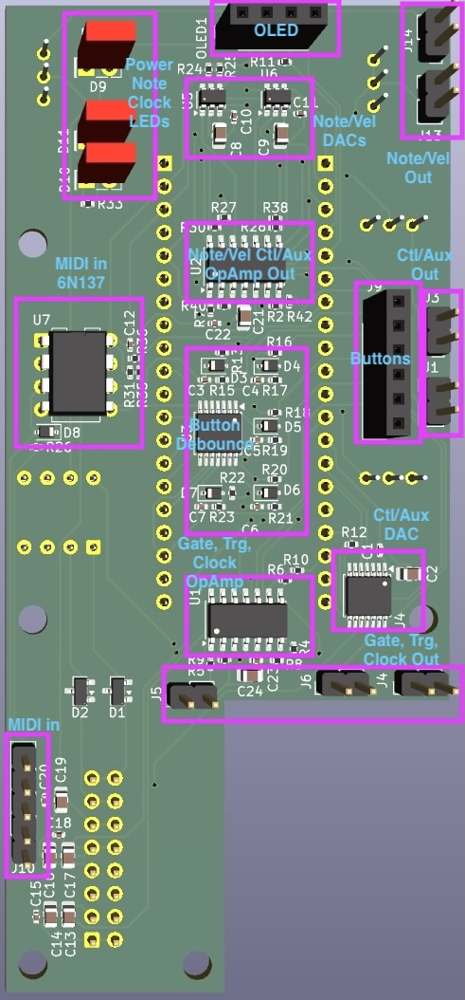
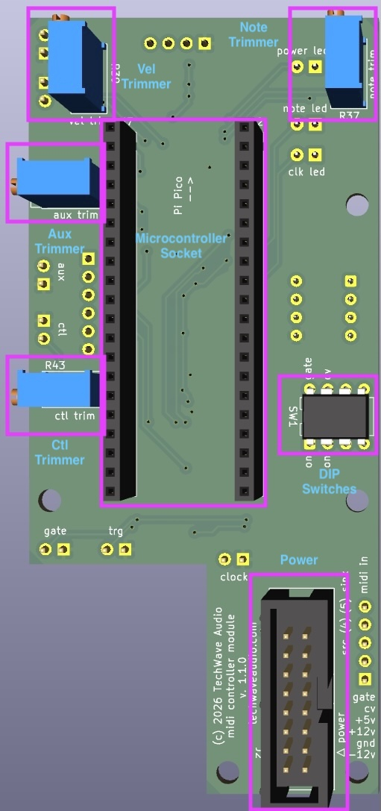
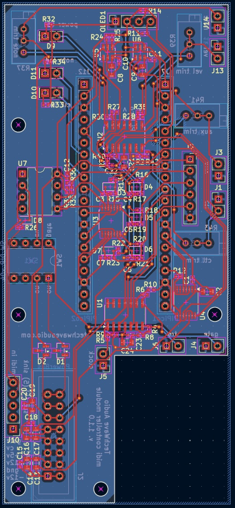

# TechWave Audio Midi Controller Module Hardware Design

Simply put, the module reads MIDI messages in, and outputs signals to digital analog controllers to provide the voltage outputs.
This is all based around a RP2040 microcontroller as the brains for handling inputs and outputs.

* [Microcontroller](#microcontroller)
* [MIDI Input](#midi-input)
* [Note and Velocity Output](#note-and-velocity-output)
* [Control and Aux Output](#control-and-aux-output)
* [Gate, Trigger, and Clock Output](#gate-trigger-and-clock-output)
* [User Input](#user-input)
* [OLED Screen](#oled-screen)
* [Power](#power)

## Front View

## Rear View

## PCB Layout

## Microcontroller
The microcontroller at the heart of the system is a RP2040 based [Raspberry Pi Pico 1](https://www.raspberrypi.com/documentation/microcontrollers/pico-series.html#pico1).
The RP2040 is a very capable and low cost with ernough GPIO, I2C, and SPI lines to handle the needs of this system.

To keep the design a bit more accessible, I made the conscience decision to use the Raspberry Pi Pico module itself instead of opting for using a discrete RP2040 chip only.
Using a discrete RP2040 itself would have allowed for a much smaller footprint on the PCB, however the using the full module allowed for easier testing overall without having to worry about getting the microcontroller section of the circuitry right (why reinvent the wheel).
It also makes flashing the firmware much easier (although I could have added a discrete USB port for doing so).

Both cores of the RP2040 are used. Core 0 handles the display, buttons, menus, and state. 
Core 1 handles the MIDI input and hardware outputs.

## MIDI Input

The MIDI input is handled by a 6N137 optocoupler that signals at +5v.
The output signal is reduced to +3.3v via a simple voltage divider to bring the signal to a manageable level for the microcontroller to use.
All processing of the signal happens within the software.

## Note and Velocity Output

The note 1v/oct and velocity signals are handled by two MCP4725 DAC ICs.
These are single channel, 12 bit DAC chips that use I2C for communication from the microcontroller.
Since these chips are able to output between 0 and +5v, the signal is then increased to the 0 to +10v range via a TL074 opamp.
Additional 1k trimming potentiometers are used to fine tune the output.

## Control and Aux Output

The control and aux signals are handled by a single MCP4902 DAC IC.
This is a single channel 8 bit DAC chip that uses SPI for communication with the microcontroller.
This chip produces a stable output voltage from 0 to +5v, which in turns is sent through a TL074 op amp to increase the range to 0 to +10v.
Like the note and velocity outputs, there are 1k trim potentiometers to fine tune the output voltages.

## Gate, Trigger, and Clock Output

The gate, trigger and clock signals all run directly from the associated GPIO pins from the microcontroller.
Because these signals coming out of the Pi Pico are at 3.3v, a TL074 op amp is used to turn the pulses into 0 to +5v signals.

## User Input

The five button input consists of four directions (up/down, forward/back) and push to enter. 
All buttons also have dedicated hardware debouncing circuits to ensure simple and accurate signaling.

Initially, four individual buttons were used for the user input.
This proved to be a challenge to fit everything into a compact 12 hp space.
The decision to use a 5 button (four-way, plus push down) interface worked out in terms of both user friendliness and space savings as well.

## OLED Screen

The OLED screen used is a 0.96" display using the SSD1306 chipset.
These modules can be found at a reasonable price, and offer enough performance for the needs of this module.
Communication with the microcontroller is via an I2C bus.

## Power

The power coupling for the module uses a standard 16 pin (2x08) IDC connector as detailed in the original [A-100 Doefer power system bus](https://doepfer.de/a100_man/a100t_e.htm).

As measured, the power draw on the +5v, +12v, and -12v lines are:
* +5v: 70mA
* +12v: 20mA
* -12v: 15mA

