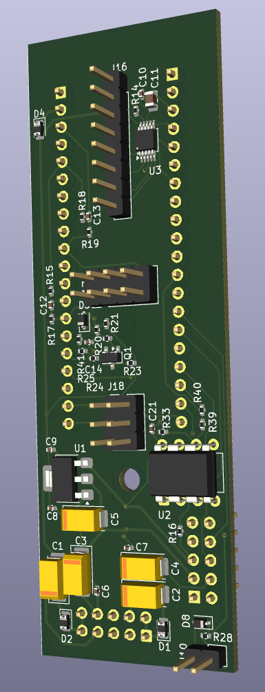
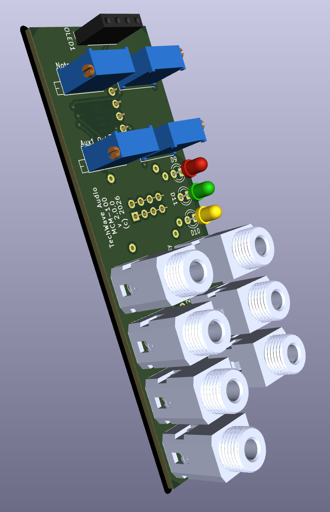
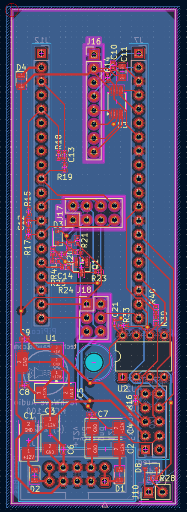
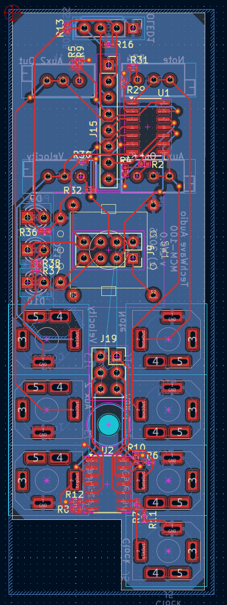
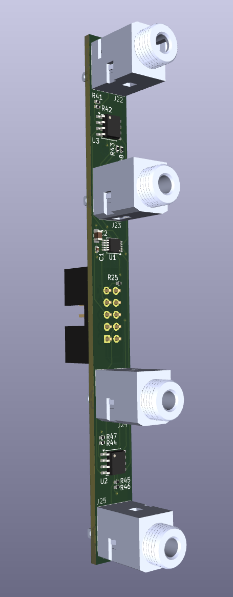
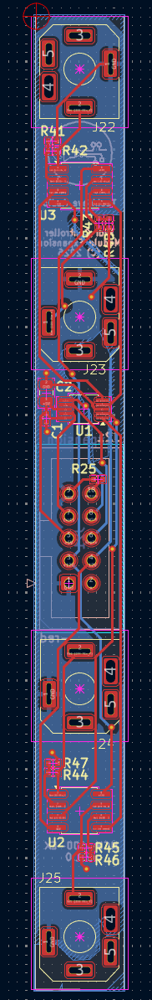

# TechWave Audio Midi Controller Module Hardware Design

Simply put, the module reads MIDI messages in, and outputs signals to digital analog controllers to provide the voltage outputs.
This is all based around a RP2040 microcontroller as the brains for handling inputs and outputs.

* [Main Board](#main-board)
  * [Microcontroller](#microcontroller)
  * [MIDI Input](#midi-input)
  * [Note, Velocity, and Out 1 and 2 DAC](#note-velocity-and-out-1-and-2-dac)
  * [Encoder Button Debounce](#encoder-button-debouncing)
  * [Power](#power)
  * [Expansion Header](#expansion-header)

* [I/O Board](#io-board)
  * [Note, Velocity, Out 1 and 2 Outputs](#note-velocity-out-1-and-2-outputs)
  * [Gate, Trigger, and Clock Output](#gate-trigger-and-clock-output)
  * [Rotary Encoder User Input](#rotary-encoder-user-input)
  * [OLED Screen](#oled-screen)
  
* [MCM-100-EX Expansion Module](#mcm-100-ex-expansion-module)

* [MCM-100 Parts List / BOM](#mcm-100-parts-list)
* [MCM-100-EX Parts List / BOM](#mcm-100-ex-parts-list)
* [Board Renderings](#board-renderings)

# Main Board

The main board (lower PCB) houses the RP2040 Raspberry Pi Pico microcontroller, MIDI input, the note, velocity, and out 1 and 2 DAC, and power handling. 

## Microcontroller
The microcontroller at the heart of the system is a RP2040 based [Raspberry Pi Pico 1](https://www.raspberrypi.com/documentation/microcontrollers/pico-series.html#pico1).
The RP2040 is a very capable and low cost with enough GPIO, I2C, and SPI lines to handle the needs of this system.

To keep the design a bit more accessible, I made the conscience decision to use the Raspberry Pi Pico module itself instead of opting for using a discrete RP2040 chip only.
Using a discrete RP2040 itself would have allowed for a much smaller footprint on the PCB, however the using the full module allowed for easier testing overall without having to worry about getting the microcontroller section of the circuitry right (why reinvent the wheel).
It also makes flashing the firmware much easier (although I could have added a discrete USB port for doing so).

Both cores of the RP2040 are used. Core 0 handles the display, buttons, menus, and state. 
Core 1 handles the MIDI input and hardware outputs.

## MIDI Input

The MIDI input from the 5-pin DIN MIDI cable jack is handled by a 6N137 optocoupler that signals at +5v.
The output signal is reduced to +3.3v via a simple voltage divider to bring the signal to a manageable level for the microcontroller to use.
COnversely, the USB-C jack is soldered directly into the data + and -, and the ground for the USB on the Pi Pico.
All processing of the signal happens within the software.

## Note, Velocity, and Out 1 and 2 DAC

The module uses a DAC7554 quad 12-bit SPI digital to analog IC for its CV output.
The Pi Pico communicates with the IC, and the resulting 0 to +5v signal is passed to the I/O board where the op amps provide additional gain and trimming.

## Encoder Button Debouncing

On the main board as well, there is a small circuit consisting of several filtering capacitors and resistors along with a NPN transistor that acts as a light hardware debounce for the rotary encoder button.
This arrangements provides for approximately a 40ms debounce of the encoder button.

## Power

The power coupling for the module uses a standard 10 pin (2x05) IDC connector as detailed in the original [A-100 Doepfer power system bus](https://doepfer.de/a100_man/a100t_e.htm).

There are a pair of schottky diodes for reverse power protection as well as several capacitors for power filtering.
A 7805 equivalent power regulator is used to drop the +12v line down to +5v for input to the microcontroller, DAC, optocoupler, and encoder button debouncing.

As measured, the maximum power draw is:
* +12v: 72mA (80mA with expansion)
* -12v: 15mA (20mA with expansion)
* +5v: 0mA

## Expansion Header

The expansion header is a 2x05 set of pin headers that the MCM-100-EX expansion cable attaches to.
The headers carry +12v/-12v/+5v power as well as SPI lines for communicating with the DAC on the expansion board.

# I/O Board

The upper I/O board contains the output jacks, the screen, rotary encoder as well as op amp gain and trimmer 

## Note, Velocity, Out 1 and 2 Outputs

The note 1v/oct and velocity signals are handled by two MCP4725 DAC ICs.
These are single channel, 12 bit DAC chips that use I2C for communication from the microcontroller.
Since these chips are able to output between 0 and +5v, the signal is then increased to the 0 to +10v range via a TL074 opamp.
Additional 1k trimming potentiometers are used to fine tune the output.

The control and aux signals are handled by a single MCP4902 DAC IC.
This is a single channel 8 bit DAC chip that uses SPI for communication with the microcontroller.
This chip produces a stable output voltage from 0 to +5v, which in turns is sent through a TL074 op amp to increase the range to 0 to +10v.
Like the note and velocity outputs, there are 1k trim potentiometers to fine tune the output voltages.

## Gate, Trigger, and Clock Output

The gate, trigger and clock signals all run directly from the associated GPIO pins from the microcontroller.
Because these signals coming out of the Pi Pico are at 3.3v, a TL074 op amp is used to turn the pulses into 0 to +5v signals.

## Rotary Encoder User Input

The rotary encoder is a standard EC11 rotary encoder.
To attach the rotary encoder to the I/O board, a custom mid-board was created.
See [the design files for the custom board](../design/RotaryEncoderCarrierBoard) in the design folder.

## OLED Screen

The OLED screen used is a 0.96" display using the SSD1306 chipset.
These modules can be found at a reasonable price, and offer enough performance for the needs of this module.
Communication with the microcontroller is via an I2C bus.

# MCM-100-EX Expansion Module

The MCM-100-EX expansion module consists of a DAC7554 quad 12-bit digital to analog converter as the main CV controller for the expansion.
Each of the outputs feeds into a TL072 op amp for additional gain before being sent to the audio jacks.
There is no external power, but rather the expansion module receives power (+12v, -12v, and +5v) from the MCM-100 via the attachment cable.
In addition, there is also a small 1k resistor that is used to read from the Pi Pico to sense the expansion is attached.

# MCM-100 Main Board Parts List

## Surface Mount Components

| ID           | Qty | Description                                              | Package |
|--------------|-----|----------------------------------------------------------|---------|
| C1-C5        | 5   | 10uF Capacitor Tantalum 6032-28                          | 6032    |
| C6-C10, C21  | 6 | 100nf Capacitor | 0402    |
|C11| 1 | 10uF Capacitor | 8085    |
|C12, C13 | 2 | 10nf Capacitor | 0402 |
|C14 | 1 | 330nf Capacitor | 0402 |
|D1, D2, D4 | 3	| Schottky	Diode | 0805 |
|D3, D8 | 2	| 1N4148 Diode | SOD-323 |
|Q1 | 1 | MMBT3904 |SOT-23|
|R14, R16 | 2 | 4.7k Resistor|0402
|R15, R17-R19, R21, R40 | 6	| 10k Resistor | 0402
|R20, R22-R24 | 4 | 100k Resistor | 0402
|R25 | 1 | 330k Resistor | 0402
|R28 | 1 | 220 Resistor | 0402
|R33 | 1 | 1k Resistor | 0402
|R39 | 1 | 5.1k Resistor | 0402
|R41 | 1 | 47k Resistor | 0402
|U1 | 1 | L7805 | SOT-223-3
|U3 | 1 | DAC7554IDGSR | TSSOP-10

## Through Hole Components

| ID  | Qty | Description           
|-----|---|-----------------------
| A1  | 1 | Raspberry Pi Pico    
| J1  | 1 | 10 pos 2x05 IDC socket
| J16 | 1 | 1x08 pin socket
| J17 | 1 | 2x04 pin socket
| J18 |	1 | 2x03 pin socket
| J20 | 1 | 2x05 pin header for expansion
| U2 | 1 | 6N137 Optocoupler

# MCM-100 I/O Board Parts List

## Surface Mount Components

| ID                     | Qty | Description | Package 
|------------------------|-----|-------------|-
| R2, R5, R31, R32 | 4 | 4.7k Resistor | 0402
| R4, R6-R9, R29, R30 | 7 | 5.1k Resistor | 0402
R10-R12 | 3 | 10k Resistor | 0402
R13, R16, R36 | 3 | 1k Resistor | 0402
R37, R38 | 2 | 330 Resistor | 0402
U1, U2 | 2 | TL074 | SOIC-14

# Through Hole Components

| ID  | Qty | Description 
|-----|-|-
| D9 | 1 | 3mm red LED for Power
| D10 | 1 | 3mm yellow LED for Clock                                              
| D1 | 1 | 3mm green LED for Note                                             
| J2-J6, J13, J14 | 7 | 3.5mm Jack, vertical
| J9  | 1 | 2x04 pin header               
| J15 | 1 | 1x08 pin header                 
| J19 | 1 | 2x03 pin header                  
| OLED1 | 1	| SSD1306 i2c OLED module, 4 pin interface
| R1, R3, R34, R35 | 4 | 1k	trimmer potentiometer 
| SW1 | 1 | EC11 Encoder Switch with Push Button (on carrier board)

# MCM-100-EX Parts List

## Surface Mount components

| ID  | Qty | Description
|-|-|--
| C1 | 1   |100nf	Capacitor SMD 0402 
| C2 | 1   |10uF Capacitor 0805 |	| | https://cdn.sparkfun.com/assets/8/a/4/a/5/Kemet_Capacitor_Datasheet.pdf  
| R25,R26 | 2 | 1k Resistor SMD 0402
| R41-R48 | 8 | 51k	Resistor SMD 0402
| U1 | 1 | DAC7554 MSOP-10 | | | http://www.ti.com/lit/gpn/DAC7554
| U2,U3 | 2 | TL072 SOIC-8 | | | http://www.ti.com/lit/ds/symlink/tl071.pdf

## Through Hole Components

| ID  | Qty | Description
|-----|---|--------------
| D1  | 1 | 3.0mm red LED	       |
| J21 |1 | 10p 2x05 IDC Docket  |
| J22-J25 | 4 | 3.5mm Jack, vertical

# Board Renderings
## Main Board Rendering

## I/O Board Rendering

## Main PCB Layout

## I/O PCB Layout

## Expansion Board Rendering

## Expansion PCB Layout

