# MIDI Controller Module Settings Menu System

## Menu System and Settings
To enter the menu system from the dashboard, press down (enter) on the rotary encoder knob.

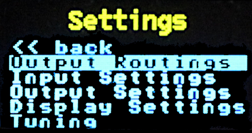

In the setting main menu screen, use the rotary encoder knob to highlight the menu item you want, and press the button to select that item. From any screen, select and press button on the << back menu entry to return to the previous screen (or to the dashboard if on the main settings menu screen).
Any changes made within the settings menu will take effect immediately (i.e. a MIDI channel change). Note that no settings are persisted until you exit back to the dashboard, with the exception when you reset the settings to the defaults.

* [Output Routings](#output-routings)
* [Input Settings](#input-settings)
* [Midi channel settings](#midi-channel-settings)
* [Note Priority Settings](#note-priority-settings)
* [Output Settings](#output-settings)
* [Note Output Settings](#note-output-settings)
* [Pitch Adjustment Settings](#pitch-adjustment-settings)
* [Pitch Bend Range Settings](#pitch-bend-range-settings)
* [Velocity Output](#velocity-output)
* [Velocity Adjustment Settings](#velocity-adjustment-settings)
* [Assignable Output Settings](#assignable-output-settings)
* [Expansion CV Outputs](#expansion-cv-outputs)
* [Trigger Duration Settings](#trigger-duration-settings)
* [Clock Division Settings](#clock-division-settings)
* [Display Settings](#display-settings)
* [Tuning Menu](#tuning-menu)
* [About](#about)
* [Reset Settings](#reset-settings)

## Output Routings

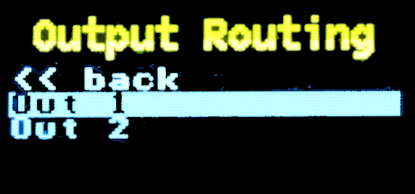

You can use the output routings menu to quickly select how to route incoming MIDI events to the Out 1 and Out 2 CV outputs (and to the X1, X2, X3 and X4 outputs if you have the expansion module attached).
Use the rotary encoder to highlight the output you wish to change the routing for and press the button down to enter the selection menu for that output.

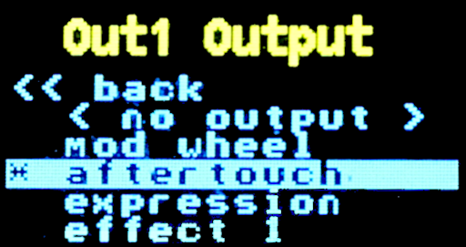

When selecting the routing for an output, use the encoder knob to highlight the event you want the output route to map to and press the encoder button to select it. The currently selected output route will have a star next to it (*). Only one event type can be routed to each of the outputs, however, you can assign the same event type to any of them. When finished, use the rotary encoder knob to highlight and select the << back menu entry.
The events that are available to map are:
* None: (do not route anything to the output)
* Aftertouch: CV output. Channel only, no poly aftertouch
* Expression: CV output. CC message 0x0B
* Mod Wheel: CV output. CC message 0x01
* Effect 1: CV output. CC message 0x0C
* Effect 2: CV output. CC message 0x0D
* Gate: signal output. +5v signal when the gate is active
* Trigger: pulse output. +5v signal pulse when a note is triggered
* Run and Continue: signal output responding to Start (sys message 0xFA) and Continue (0xFB). The output will be a +5v signal held high, only turned off by a reset or reset all event.
* Reset: pulse output. Sys message 0xFC, Stop (+5v signal pulse)
* Note: CV output. MIDI note number when there is a note on event
* Velocity: CV output. velocity value when there is a note on event
* Clock ticks: pulse output. +5v pulse when a clock sync is received (sys message 0xF8). The clock ticks are configurable to pulse with every tick, or every 2, 4, 6, 8, 12, 24, 36, 48, 60, 72, or 96 ticks.

## Input Settings
Through the input settings menu, you can set the midi channel and the input note priority settings.

## Midi channel settings
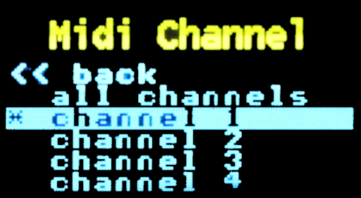

Set the MIDI channel to listen for incoming events on. You can select from channels 1 through 16, as well as (all channels).
Use the rotary encoder to select the channel setting and press the button to change the channel to listen on. The current setting with have a star next to it (*). Select the << back entry to go back to the main menu.

## Note Priority Settings
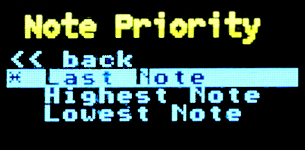

Sets the note priority for incoming note on events.
The available selections are:
* Last Note: The last incoming note event
* Highest Note: Only the highest note events are kept
* Lowest Note: Only the lowest note events are kept

Use the rotary encoder to select the note priority setting and press the encoder button to change it. The current setting with have a star next to it (*). Select the << back menu selection to go back to the input settings menu.

## Output Settings

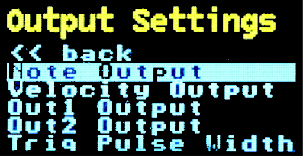

In the output settings menu, select the output you want to configure. For each of the CV outputs - note, velocity, Out 1, Out 2 (and additionally X1, X2, X3, and X4 if the expansion module is attached) - the output can be configured to a maximum CV output of +10 volts or +5 volts. All signal or pulse outputs are always at +5 volts. Here you can also adjust the pulse width of the trigger event as well as the clock output settings.
For the note output, at +10 volts maximum output, the note on events respond to notes C-1 (note number 0) to B9 (note number 119). For +5 volts output, note on events respond to notes C2 (middle-C, note number 36) to B6 (note number 95).

## Note Output Settings
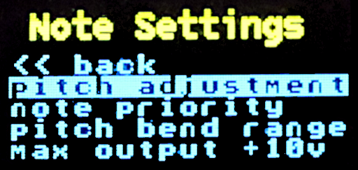

From the note output settings, you can adjust the pitch of the 1v/oct note output CV, the pitch bend range number of octaves, or the maximum voltage for the note CV output. To change the maximum voltage output, use the rotary encoder to highlight the menu item and press the encoder button to toggle between +10v and +5v. 

## Pitch Adjustment Settings

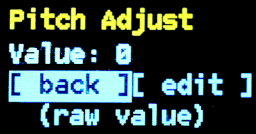

Allows for adjustment of the outgoing CV value. The pitch adjustment allows for approximately +/- 6% output voltage (limited to 0 to +10/+5v). The adjustment slider ranges from -250.0 to 250.0 for the output value to the 12-bit DAC.

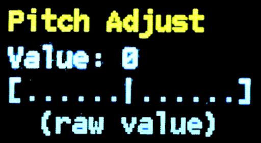

Select the edit menu item with the encoder and press the encoder button to start editing the value. When editing the value, turn the rotary encoder left or right to change the value. Press the encoder button to set the value and go back. Select the back menu item to go back to the previous menu.

## Pitch Bend Range Settings
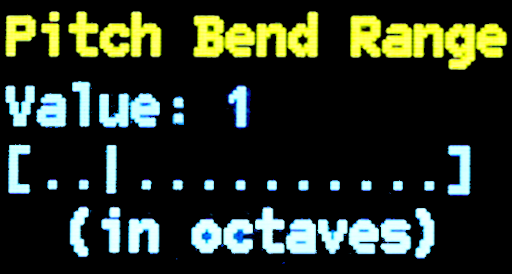

Sets the number of +/- octaves the pitch bend will cover from 0 to 5 octaves.
Select the [ edit ] menu item with the encoder and press the encoder button to start editing the value (in octaves or part of an octave). When editing the value, turn the rotary encoder left or right to change the value. Press the encoder button to set the value and go back. Select the [ back ] choice to go back to the previous menu.

## Velocity Output

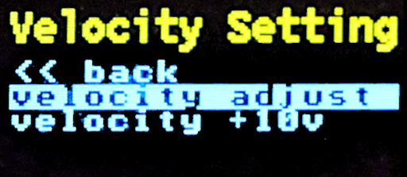

From the velocity output menu, you can choose to adjust the velocity output via the “velocity adjust” menu selection, or the maximum voltage output for the velocity CV output. To change the maximum voltage output, use the rotary encoder to highlight the menu item and press the encoder button to toggle between +10v and +5v.

## Velocity Adjustment Settings

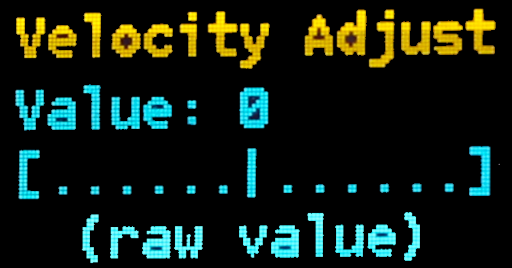

Allows for adjustment of the outgoing velocity value. The velocity adjustment allows for approximately +/- 6% output voltage (limited to 0 to +10/+5v). The adjustment slider ranges from -250.0 to 250.0 for the output value to the 12-bit DAC.
Select the [ edit ] menu item with the encoder and press the encoder button to start editing the value. When editing the value, turn the rotary encoder left or right to change the value. Press the encoder button to set the value and go back. Select the [ back ] choice to go back to the previous menu.

## Assignable Output Settings

You can configure the output settings for Out 1 and Out 2. From this menu, you can choose the event routing for the selected CV output as well as output voltage (either +10v to +5v max).
To route a MIDI event to the output, select the route menu item selection to choose what event should be routed to the output. The currently selected event output will be indicated with a star ‘*’ next to it. See the “Output Routings” section above for the list of assignable routes.
To change the maximum voltage output, use the rotary encoder to highlight the menu item and press the encoder button to toggle between +10v and +5v.

### Expansion CV Outputs
If you have the MCM-100-EX Expansion Module attached, you will be able to change the settings for the X1, X2, X3, and X4 outputs in the same manner as Out 1 and Out 2. Much the same, these outputs can have a MIDI event routed to them and the maximum output change be changed between +10v and +5v.

## Trigger Duration Settings

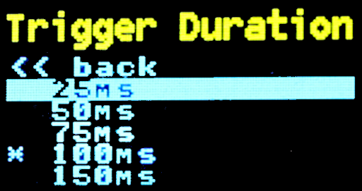

You can set how long the trigger pulse stays high when a note is turned on. The values range from 25 ms to 500 ms (default 100ms).
Use the rotary encoder to highlight the trigger duration and press the encoder button to select it. The current setting with have a star next to it (*). Select the << back menu option to go back to the previous menu.

## Clock Division Settings
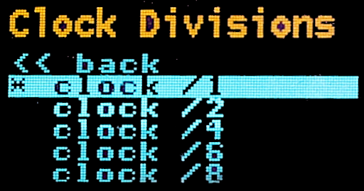

This menu allows you to set the output to the clock +5v pulse line. By default, every clock tick is sent as a pulse. In this menu, you can configure the system to send the pulse at other intervals including:
* every tick (24 times per frame)
* every 2 ticks (12 times per frame)
* every 4 ticks (6 times per frame)
* every 6 ticks (4 times per frame)
* every 8 ticks (3 times per frame)
* every 12 ticks (2 times per frame)
* every 24 ticks (once per frame)
* every 36 ticks (once every 1½ frames)
* every 48 ticks (once every two frames)
* every 60 ticks (once every two and ½ frames)
* every 72 ticks (once every three frames)
* every 96 ticks (once every four frames)

Use the rotary encoder to highlight the clock division setting you wish to use and press the encoder button to set it. The current setting with have a star next to it (*). Select the << back menu item to go back to the previous menu.

## Display Settings

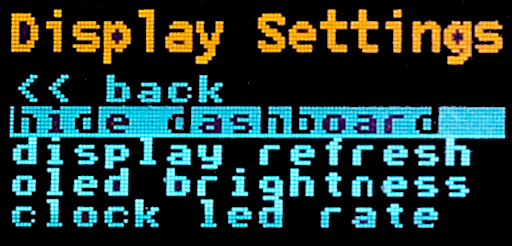

This menu allows you to modify the display settings for the dashboard and clock LED. The setting here include:
* Hide / show dashboard: keeps the dashboard display on or off when not in the menu. Highlight the menu item and press the encoder button to toggle hidden or showing.
* Dashboard refresh: sets the number of milliseconds for every refresh of the dashboard when displayed. Highlight the menu item and press the encoder button to go into the menu to choose the refresh rate. The current setting will have a star ‘*’ next to it.
* Display brightness: set the brightness of the display screen. To set the screen brightness, use the range editor to select a brightness level from 1 (dim) to 16 (most bright).
* Clock LED refresh: sets how often the clock LED blinks when receiving MIDI clock tick events.
  * off
  * every tick
  * every 2 ticks
  * every 3 ticks
  * every 6 ticks
  * every 12 ticks
  * every 24 ticks (full cycle)

Use the rotary encoder to select the setting to change and press the encoder button to select it. Select the << back entry to go back to the main menu.

## Tuning Menu
The tuning menu can be used to output a continuous voltage on the note CV output.
Use the rotary encoder to select the note to output and press the encoder button. The selected note voltage will be sent to the note CV output, and the gate line will turn on. You can then use an electronic tuner to adjust your VCO pitch, or alternatively an oscilloscope to view the frequency output from your mixer. The CV output will depend on the setting of the output voltage in the output voltage settings for the note output. Note that in the title area of the menu, the current max output voltage is displayed. Press the encoder button again to stop the output. Select the <<back menu item to go back to the main menu.

## About
Displays the current version and build information of the firmware. Press the encoder button to return to the main menu.

## Reset Settings
Allows you to reset the settings to their defaults. Use the rotary encoder to select the [confirm] reset item and press the encoder button to reset the module to the system default values. If you do not wish to reset the settings select the [ cancel ] item.
Note that if you do reset the settings, the default settings will immediately be saved over any custom configuration.
The default settings are:
* MIDI channel: 1
* Note priority: last note
* Pitch adjustment: 0.00
* Velocity adjustment: 0.00
* Pitch bend range: +/- 1 octave
* Out 1 route: aftertouch
* Out 2 route: mod wheel
* Trigger duration: 100 ms
* Clock divisions: every tick
* Note output max voltage: +10v
* Velocity output max voltage: +10v
* Out 1 output max voltage: +10v
* Out 2 output max voltage: +10v
* Dashboard display: on
* Dashboard refresh: every 25 ms
* Display brightness: 12 (about 75%)
* Clock LED: every 12 ticks

If you have the MCM-100-EX Expansion Module as well, all CV outputs X1, X2, X3, and X4 will all have their route set to “none”, and their max voltage set to +10v.

