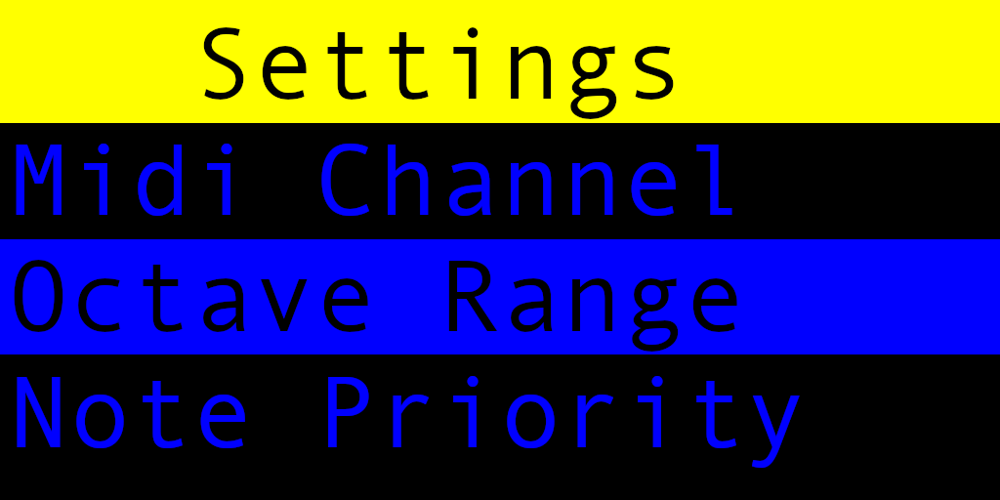
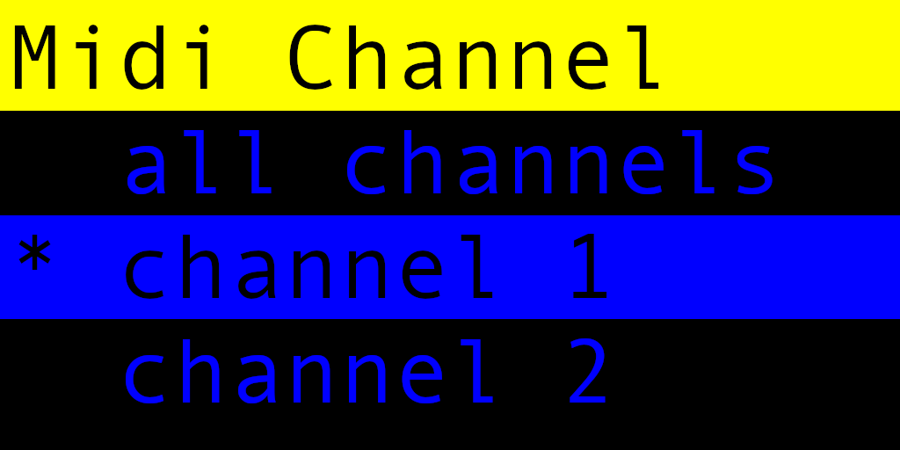
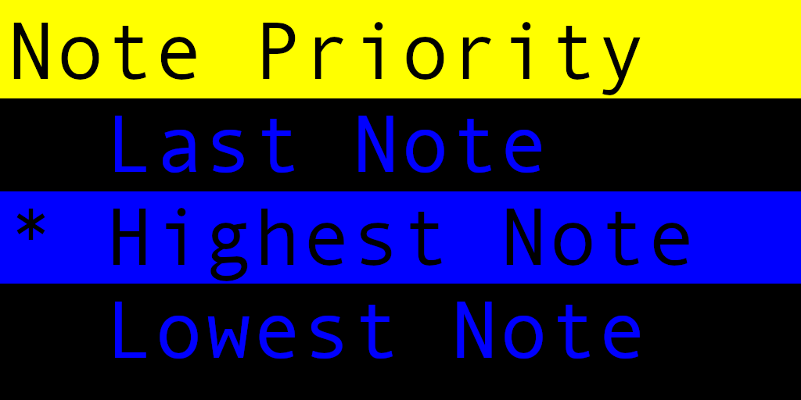
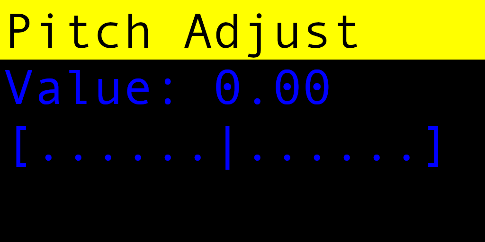
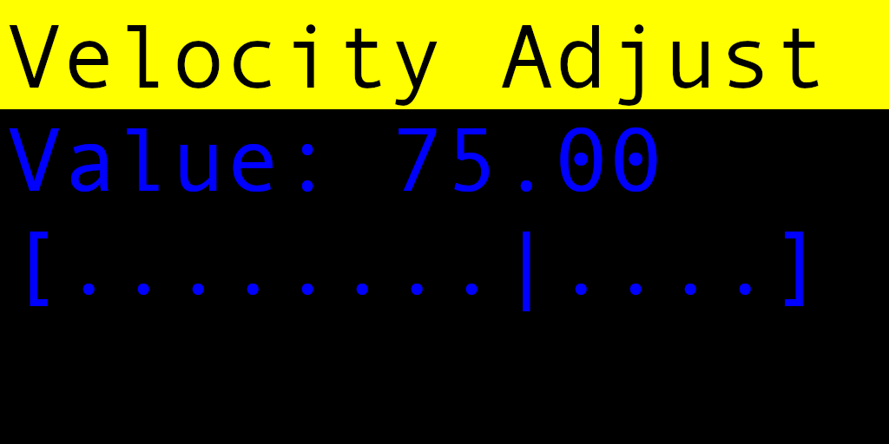

# MIDI Controller Module Menu System

## Settings Main Menu

In the setting main menu screen, use the `up` and `down` buttons to highlight the menu items, and `enter` to select that item.
Use the `back` button to exit out of the menu system and back to the dashboard.

Any changes made within the settings menu will take effect immediately (i.e. a MIDI channel change).
Note however that no settings are persisted until you exit back to the dashboard, with the exception of when you reset the settings to the defaults.

* [MIDI Channel Settings](#midi-channel-settings)
* [Note Priority Settings](#note-priority-settings)
* [Pitch Adjustment Settings](#pitch-adjustment-settings)
* [Velocity Adjustment Settings](#velocity-adjustment-settings)
* [Pitch Bend Range Settings](#pitch-bend-range-settings)
* [Aux Output Settings](#aux-output-settings)
* [Control Output Settings](#control-output-settings)
* [Trigger Duration Settings](#trigger-duration-settings)
* [Output Voltage Settings](#output-voltage-settings)
* [Display Settings](#display-settings)
* [Diagnostic Menu](#diagnostic-menu)
* [Reset All](#reset-all)
* [Exit](#): exits to the dashboard)

## MIDI Channel Settings

Set the MIDI channel to listen for incoming events on.
You can select from channels 1 through 16, as well as (all channels).

Use the `up` and `down` arrows to select the channel setting, and `enter` to change it.
The current setting with have a star next to it (`*`).
Use the `back` button to go back to the main menu.

## Note Priority Settings

Sets the note priority for incoming note on events.

The available selections are:
* Last Note: The last incoming note event
* Highest Note: Only the highest note events are kept
* Lowest Note: Only the lowest note events are kept

Use the `up` and `down` arrows to select the note priority, and `enter` to change it.
The current setting with have a star next to it (`*`).
Use the `back` button to go back to the main menu.

## Pitch Adjustment Settings

Allows for adjustment of the outgoing CV value.
The pitch adjustment allows for approximately +/- 6% output voltage (limited to 0 to +10/+5v).
The adjustment slider ranges from -250.0 to 250.0 for the output value to the 12-bit DAC.

Use the `up` and `down` arrows to change the slider for the pitch adjustment.
Press the `enter` key to confirm the new setting, or the `back` key to cancel.

## Velocity Adjustment Settings

Allows for adjustment of the outgoing velocity value.
The velocity adjustment allows for approximately +/- 6% output voltage (limited to 0 to +10/+5v).
The adjustment slider ranges from -250.0 to 250.0 for the output value to the 12-bit DAC.

Use the `up` and `down` arrows to change the slider for the velocity adjustment.
Press the `enter` key to confirm the new setting, or the `back` key to cancel.

## Pitch Bend Range Settings

Sets the number of +/- octaves the pitch bend will cover. 

Use the `up` and `down` arrows to change the slider for the pitch bend range (in octaves).
Press the `enter` key to confirm the new setting, or the `back` key to cancel.

## Aux Output Settings

Sets the function of what events are sent to the aux channel. 
Only one event type can use the aux output at a time.
The available events allowed are:

* Aftertouch (channel only, no poly aftertouch)
* Expression (CC message `0x0B`)

Use the `up` and `down` arrows to select the aux output function, and `enter` to change it.
The current setting with have a star next to it (`*`).
Use the `back` button to go back to the main menu.

## Control Output Settings

Sets the function of what events are sent to the control channel.
Only one event type can use the control output at a time.
The available events allowed are:

* Mod Wheel (responds to CC message `0x01`)
* Effect 1 (CC message `0x0C`)
* Effect 2 (CC message `0x0D`)

Use the `up` and `down` arrows to select the control output function, and `enter` to change it.
The current setting with have a star next to it (`*`).
Use the `back` button to go back to the main menu.

## Trigger Duration Settings

You can set how long the trigger pulse stays high when a note is turned on.

The values range from 25 ms to 500 ms.

Use the `up` and `down` arrows to select the trigger duration, and `enter` to change it.
The current setting with have a star next to it (`*`).
Use the `back` button to go back to the main menu.

## Output Voltage Settings

Use the `up` and `down` arrows to select the output and `enter` to toggle it between +10v and +5v.
The value for the output shows the _current_ voltage setting.
Use the `back` button to go back to the main menu.

## Display Settings

* Dashboard on / off : keeps the dashboard display on or off when not in the menu.
* Dashboard refresh: sets the number of ms for every refresh of the dashboard when displayed.
* Clock LED: sets how often the clock LED blinks when receiving MIDI clock tick events.
  * off
  * every tick
  * every 2 ticks
  * every 3 ticks
  * every 6 ticks
  * every 12 ticks
  * every 24 ticks (full cycle)

## Diagnostic Menu

Various diagnostic utilities for testing the hardware.
While the diagnostic menu is active, MIDI processing for the main run loop is paused.

### Note output sweep

### Velocity output sweep

### Aux output sweep

### Control output sweep

### Trigger pulse test

### Gate pulse test

### Clock pulse test

### MIDI input test display 

Displays a running log of translated MIDI messages coming in.

## Reset All

Allows you to reset the settings to their defaults. Press the enter key to reset, or back to cancel.

Note that if you do reset the settings, the default settings will be persisted and you will lose any custom configurations.

The default settings are:
* MIDI channel: 1
* Note priority: last note
* Pitch adjustment: 0.00
* Velocity adjustment: 0.00
* Pitch bend range: -2 steps to +2 steps
* Aux output: aftertouch
* Control output: mod wheel
* Trigger duration: 100 ms
* Note output max voltage: +10v
* Velocity output max voltage: +10v
* Aux output max voltage: +10v
* Control output max voltage: +10v
* Dashboard display: on
* Dashboard refresh: every 200 ms
* Clock LED: every 12 ticks

