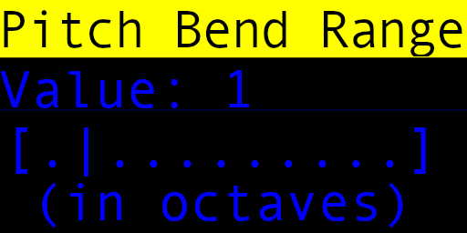
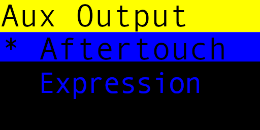
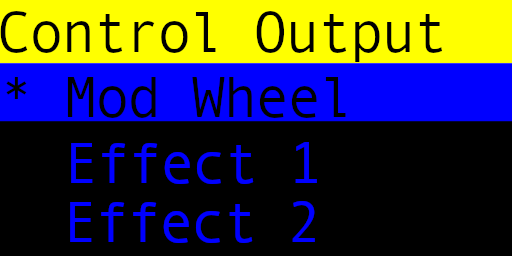
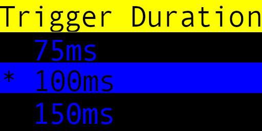
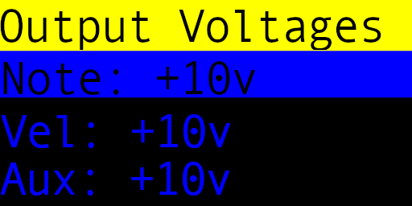
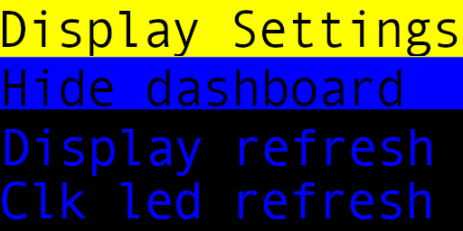
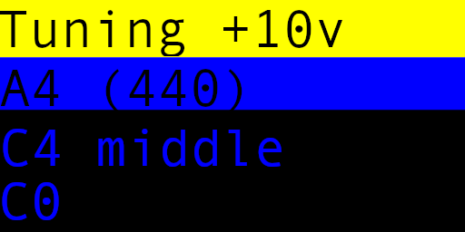
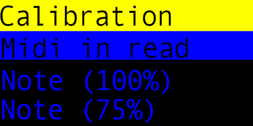
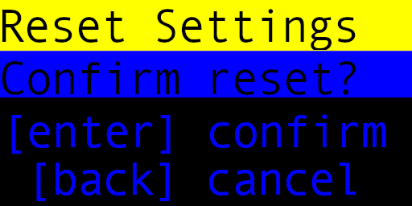

# MIDI Controller Module Settings Menu System

## Settings Main Menu

In the setting main menu screen, use the `up` and `down` buttons to highlight the menu items, and `enter` to select that item.
Use the `back` button to exit out of the menu system and back to the dashboard.

Any changes made within the settings menu will take effect immediately (i.e. a MIDI channel change).
Note however that no settings are persisted until you exit back to the dashboard, with the exception of when you reset the settings to the defaults.

* [MIDI Channel Settings](#midi-channel-settings)
* [Note Priority Settings](#note-priority-settings)
* [Pitch Adjustment Settings](#pitch-adjustment-settings)
* [Velocity Adjustment Settings](#velocity-adjustment-settings)
* [Pitch Bend Range Settings](#pitch-bend-range-settings)
* [Aux Output Settings](#aux-output-settings)
* [Control Output Settings](#control-output-settings)
* [Trigger Duration Settings](#trigger-duration-settings)
* [Output Voltage Settings](#output-voltage-settings)
* [Display Settings](#display-settings)
* [Tuning Menu](#tuning-menu)
* [Calibration](#calibration-menu)
* [About](#about)
* [Reset All](#reset-all)

## MIDI Channel Settings

Set the MIDI channel to listen for incoming events on.
You can select from channels 1 through 16, as well as (all channels).

Use the `up` and `down` arrows to select the channel setting, and `enter` to change it.
The current setting with have a star next to it (`*`).
Use the `back` button to go back to the main menu.

## Note Priority Settings

Sets the note priority for incoming note on events.

The available selections are:
* Last Note: The last incoming note event
* Highest Note: Only the highest note events are kept
* Lowest Note: Only the lowest note events are kept

Use the `up` and `down` arrows to select the note priority, and `enter` to change it.
The current setting with have a star next to it (`*`).
Use the `back` button to go back to the main menu.

## Pitch Adjustment Settings

Allows for adjustment of the outgoing CV value.
The pitch adjustment allows for approximately +/- 6% output voltage (limited to 0 to +10/+5v).
The adjustment slider ranges from -250.0 to 250.0 for the output value to the 12-bit DAC.

Use the `up` and `down` arrows to change the slider for the pitch adjustment.
Press the `enter` key to confirm the new setting, or the `back` key to cancel.

## Velocity Adjustment Settings

Allows for adjustment of the outgoing velocity value.
The velocity adjustment allows for approximately +/- 6% output voltage (limited to 0 to +10/+5v).
The adjustment slider ranges from -250.0 to 250.0 for the output value to the 12-bit DAC.

Use the `up` and `down` arrows to change the slider for the velocity adjustment.
Press the `enter` key to confirm the new setting, or the `back` key to cancel.

## Pitch Bend Range Settings

Sets the number of +/- octaves the pitch bend will cover. 

Use the `up` and `down` arrows to change the slider for the pitch bend range (in octaves).
Press the `enter` key to confirm the new setting, or the `back` key to cancel.

## Aux Output Settings

Sets the function of what events are sent to the aux channel. 
Only one event type can use the aux output at a time.
The available events allowed are:

* Aftertouch (channel only, no poly aftertouch)
* Expression (CC message `0x0B`)

Use the `up` and `down` arrows to select the aux output function, and `enter` to change it.
The current setting with have a star next to it (`*`).
Use the `back` button to go back to the main menu.

## Control Output Settings

Sets the function of what events are sent to the control channel.
Only one event type can use the control output at a time.
The available events allowed are:

* Mod Wheel (responds to CC message `0x01`)
* Effect 1 (CC message `0x0C`)
* Effect 2 (CC message `0x0D`)

Use the `up` and `down` arrows to select the control output function, and `enter` to change it.
The current setting with have a star next to it (`*`).
Use the `back` button to go back to the main menu.

## Trigger Duration Settings

You can set how long the trigger pulse stays high when a note is turned on.

The values range from 25 ms to 500 ms (default 100ms).

Use the `up` and `down` arrows to select the trigger duration, and `enter` to change it.
The current setting with have a star next to it (`*`).
Use the `back` button to go back to the main menu.

## Output Voltage Settings

Using this menu, you can change the max output voltage for the four CV outputs from +10v to +5v.
The default output voltage for all CV outputs is +10v.

Use the `up` and `down` arrows to select the output and `enter` to toggle it between +10v and +5v.
The value for the output shows the _current_ voltage setting.
Use the `back` button to go back to the main menu.

## Display Settings

* Dashboard on / off : keeps the dashboard display on or off when not in the menu.
* Dashboard refresh: sets the number of ms for every refresh of the dashboard when displayed.
* Clock LED refresh: sets how often the clock LED blinks when receiving MIDI clock tick events.
  * off
  * every tick
  * every 2 ticks
  * every 3 ticks
  * every 6 ticks
  * every 12 ticks
  * every 24 ticks (full cycle)

## Tuning Menu

Using the `up` and `down` arrows, select the note value to output and press `enter`.
The selected note voltage will be sent to the `note` CV output, and the `gate` line will turn on.
You can then use an electronic tuner to adjust your VCO pitch, or alternatively an oscilloscope to view the frequency output from your mixer.
The CV output will depend on the setting of the output voltage in the [output voltage settings](#output-voltage-settings) for the note output.
Note that in the title area of the menu, the current max output voltage is displayed.
Press the `back` button to stop the current note played.
Also press the `back` button on the selection screen to go back to the main menu.

## Calibration Menu

Use the `up` and `down` buttons to select which calibration to run. 
Press `enter` to run the calibration test.
When the test is running, press the `back` button to stop the test and return to the calibration menu.
Press the `back` button in the menu selection screen to go back to the main menu.

### MIDI input test display

Displays a running log of translated MIDI messages coming in.

### Note, Velocity, Aux and Control calibration

You can select the output level of the CV output at 100%, 75%, 50%, or 25%.
The selected output will be sent to the CV output and you can use a meter or oscilloscope to check the voltage level.
The maximum output will depend on the setting of the output voltage in the [output voltage settings](#output-voltage-settings) for the selected CV output.
For +10v output, the calibration should be adjusted to as close to 10v, 7.5v, 5v, and 2.5v respectively.
For +5v output, the calibration should be adjusted to as close to 5v, 3.75v, 2.5v, and 1.25v.

### Pulse gate, trigger and clock

Running the calibration for the gate, trigger and clock lines will pulse those lines from 0 to +5v in a square wave.
The signal will go high for 250ms, then low for 250ms continuously.

## About

Displays the current version and build information of the firmware.

## Reset All

Allows you to reset the settings to their defaults. Press the enter key to reset, or back to cancel.

Note that if you do reset the settings, the default settings will be persisted and you will lose any custom configurations.

The default settings are:
* MIDI channel: 1
* Note priority: last note
* Pitch adjustment: 0.00
* Velocity adjustment: 0.00
* Pitch bend range: +/- 1 octave
* Aux output: aftertouch
* Control output: mod wheel
* Trigger duration: 100 ms
* Note output max voltage: +10v
* Velocity output max voltage: +10v
* Aux output max voltage: +10v
* Control output max voltage: +10v
* Dashboard display: on
* Dashboard refresh: every 200 ms
* Clock LED: every 12 ticks

