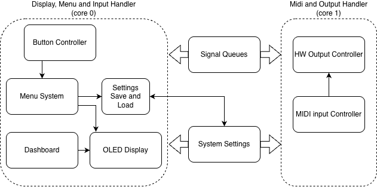

# Midi Controller Module Software Design

The functionality of the software can be broken up into several components across the two cores with two shared objects.

Core 0 handles the user input, display, and settings persistance. Core 1 handles the real-time MIDI input and hardware outputs.

## Shared Objects and Cross-core Communication

### Timed Event Queues

There are several [timed event queue](../src/TimedEventQueue.h) objects that are used throughout.
These queues provide a thread-safe priority queue that handles messaging and callback functions.
The queues are kept in priority order based on when the next event is scheduled to be called in chronological order. 

### Signal Queue

Signal queues are used to end [short messages with data](../src/TechWaveAudio_MidiControllerModule.h#L451) between the two cores in a real-time and thread safe manner.
Signals sent from core 0 to core 1 include messages for starting and stopping the output controller and for when shutting the system down.
Signals send from core 1 to core 0 include messages for letting core 0 know the state of the output for display purposes.

Communication across the two cores is performed via the use of two queues.
The first queue is read by core 0 and written to by core 1.
The other queue is written by core 0 and read by core 1.

### System Settings

The shared global [system state object](../src/SystemState.h) is available to both cores.
The modifiable cross-core settings are declared volatile, however in practice, only core 0 ever modifies the values and core 1 only reads them.

The state also includes items for ensuring persistence to the on-board Pico flash storage to ensure the latest state is available, and a checksum for integrity. 

## Core 0 (Display, Menu, and Input)

### OLED Display and Frame Buffer

The [OLED display](../src/hardware/Ssd1306.h) is based on an I2C SSD1306 module.
Underlying the hardware, a generic [monochrome LCD frame buffer object](../src/hardware/MonoLcdFramebuffer.h) is used to make it easier to write primitives to which the SSD1306 can use to then transform the data as needed to display the actual image.

### Dashboard

The [dashboard display](../src/display/DashboardDisplay.h) holds the state of the hardware output, and is able to be updated from state messages from core 1.

### Settings Menu System and System Settings Persistence 

The [settings menu system](../src/SettingsMenuSystem.h) is responsible for handling the entering and callbacks for the menus, as well as settings persistence.

The menus are all derived from the [base menu class](../src/menu/BaseMenu.h) which provides a common interface for menu initialization, display, and button handling callbacks.

The [system setting persistence](../src/SettingsMenuSystem.cpp#L69) provides an interface to and from the Pico's onboard flash memory.
The settings are saved if any setting is changed and the user goes back to the dashboard from the menu, or the settings are reset from the "reset all" menu.
The latest settings are loaded upon the system startup.
Wear leveling is in place for the saving of settings to extend the longevity of the flash memory.

### Button Controller

The [controller buttons](../src/ControllerButtons.h) class provides an interface from the [hardware buttons](../src/hardware/Button.h) in the form of settable callback functions.

## Core 1 (MIDI and Output)

### MIDI Input

The [MIDI controller class](../src/io/MidiController.h) starts and stops the IRQ handling for listening on the UART pins to read incoming data, and translate it to MIDI messages.
The class has settable callbacks for each of the MIDI messages it is able to process.

### Hardware Output

The [output controller](../src/io/OutputController.h) is responsible for providing the actual callback functions that the MIDI controller uses, and communication with the DACs and signal output lines.

